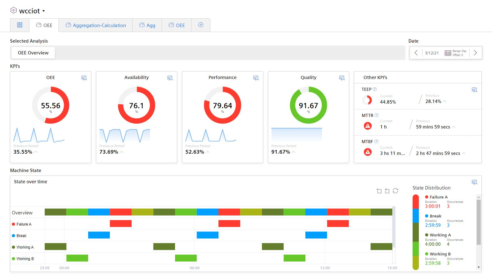

# Performance Insight OEE analysis

This example shows how to use the Industrial Edge App "Performance Insight" with it´s embedded OEE dashboard to present the productivity of a plant transparently.

- [Performance Insight OEE analysis](#performance-insight-oee-analysis)
  - [Description](#description)
    - [Overview](#overview)
    - [General task](#general-task)
  - [Requirements](#requirements)
    - [Prerequisities](#prerequisities)
    - [Used components](#used-components)
    - [TIA Project](#tia-project)
  - [Configuration steps](#configuration-steps)
  - [Usage](#usage)
  - [Documentation](#documentation)
  - [Contribution](#contribution)
  - [Licence and Legal Information](#licence-and-legal-information)

## Description

### Overview

This document describes how to create a Performance insight OEE analysis dashboard.
With the key figure of Overall Equipment Effectiveness (OEE), you can calculate the productivity of a plant or its losses and display them transparently using the Gantt widget. The OEE widgets are predefined, only a few parameters have to be defined in the OEE settings.

The overall equipment effectiveness of a plant is defined as the product of the following three factors:
- Availability factor (e.g. whether there are fault times)
- Performance factor (e.g. whether the system is running at full load or reduced load)
- Quality factor (e.g. how much scrap is produced)

<kbd></kbd>

### General task

This example is a supplement to Performance Insight getting started see [performance-insight-getting-started](https://github.com/industrial-edge/performance-insight-getting-started).
For the Performance Insight OEE analysis, [this](#tia-project) TIA project is required.
In Performance Insight, the OEE analysis settings are configured and then displayed as a dashboard.

## Requirements

###  Prerequisities

- Access to an Industrial Edge Management System (IEM)
- Onboarded Industial Edge Device on IEM
- Performance Insight getting started [performance-insight-getting-started](https://github.com/industrial-edge/performance-insight-getting-started)

### Used components

- Industrial Edge Management (IEM) V1.2.16 (OS) V1.2.0-36
  - IE Databus V1.2.16
  - IE Databus Configurator V1.2.23
  - S7 Connector V1.2.26
  - S7 Connector Configurator V1.2.32
  - Data Service V1.2.0
  - Performance Insight V1.2.1
- Industrial Edge Device V 1.2.0-56
- TIA Portal V16
- CPU 1511-1 PN

### TIA Project

The used TIA Portal project can be found in the [miscellenous repository](https://github.com/industrial-edge/miscellaneous/tree/main/tank%20application)  under the following name and is also used for several further application examples:

- [tia-tank-application.7z](https://github.com/industrial-edge/miscellaneous/blob/main/tank%20application/tia-tank-application.7z)

## Configuration steps

You can find further information about the following steps [here](docs/Installation.md)
- Configure Data Service
- Configure Performance Insight
- Display OEE dashboard

## Usage

Once the Data Service app is configured and data is availalbe from a running PLC, process data can be collected.
Performance Insight visualises this data in an OEE dashboard.

## Documentation

You can find further documentation and help in the following links
  - [Industrial Edge Hub](https://iehub.eu1.edge.siemens.cloud/#/documentation)
  - [Industrial Edge Forum](https://www.siemens.com/industrial-edge-forum)
  - [Industrial Edge landing page](https://new.siemens.com/global/en/products/automation/topic-areas/industrial-edge/simatic-edge.html)
  
## Contribution

Thanks for your interest in contributing. Anybody is free to report bugs, unclear documenation, and other problems regarding this repository in the Issues section or, even better, is free to propose any changes to this repository using Merge Requests.

## Licence and Legal Information

Please read the [Legal information](LICENSE.md).
