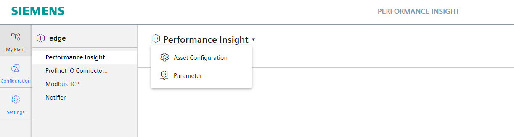

# Configuration

- [Configuration](#configuration)
  - [Configure Data Service](#configure-data-service)
  - [Configure Performance Insight](#configure-performance-insight)
    - [Configure status mapping](#configure-status-mapping)
    - [Configure KPI types](#configure-kpi-types)
    - [Configure Parameter](#configure-parameter)
    - [Configure OEE settings](#configure-oee-settings)
  - [Display OEE dashboard](#display-oee-dashboard)

## Configure Data Service

Create a new asset with the following variables in the Data Service to collect all needed data.

<kbd></kbd>

## Configure Performance Insight

### Configure status mapping

Open the Performance Insight status mapping and create a new status mapping which is needed later for the OEE settings.

<kbd></kbd>

### Configure KPI types

Create two new KPI types to calculate the "theoretical speed" and the "good count", which are later needed to define parameters in the OEE settings.

<kbd></kbd>

<kbd></kbd>

### Configure Parameter

Open the parameters in the respective asset and create two new KPI instances for "theoretical speed" and "good count".

<kbd></kbd>

<kbd></kbd>

### Configure OEE settings

Open Asset Configuration in the respective asset and define OEE settings.

<kbd></kbd>

<kbd></kbd>

- Select the created machine status under "status mapping

- Select the machine status variable "GDB_operate_machineState"

- Select the respective variables and created KPI types

- Click on save
 

<kbd></kbd>

## Display OEE dashboard

Open your asset in which the OEE settings have been made and select the tab "OEE". Choose a proper time range within the dashboard for which data is definitely available.

<kbd></kbd>

