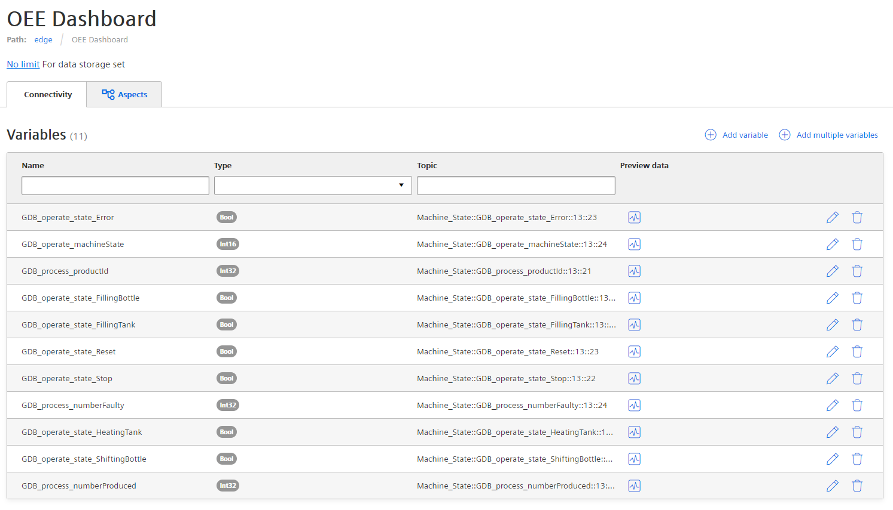
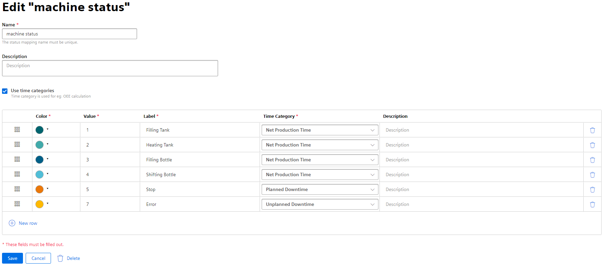
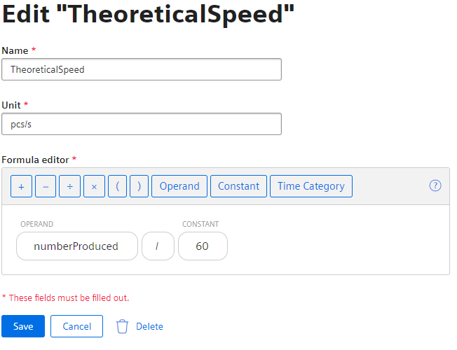
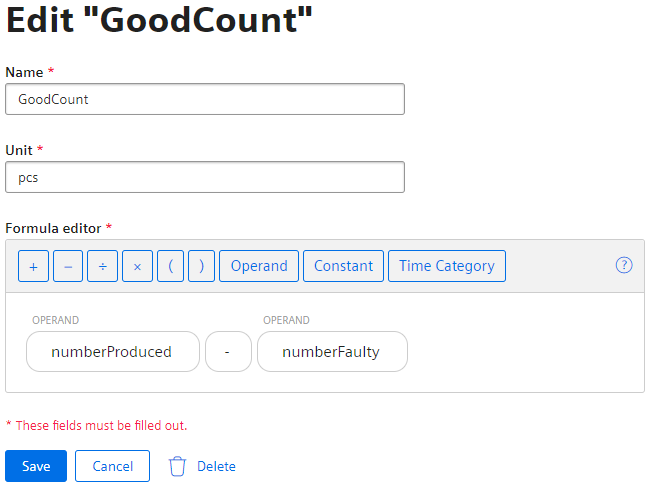
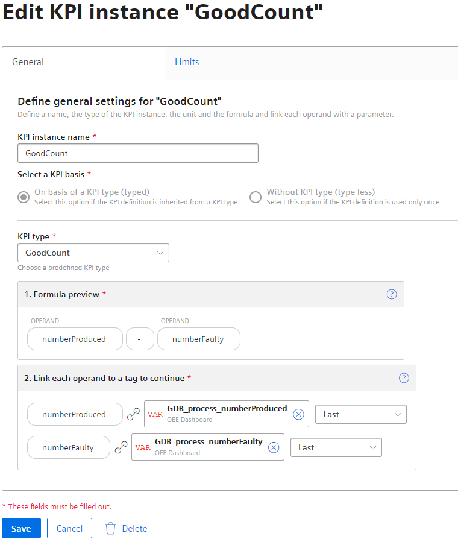
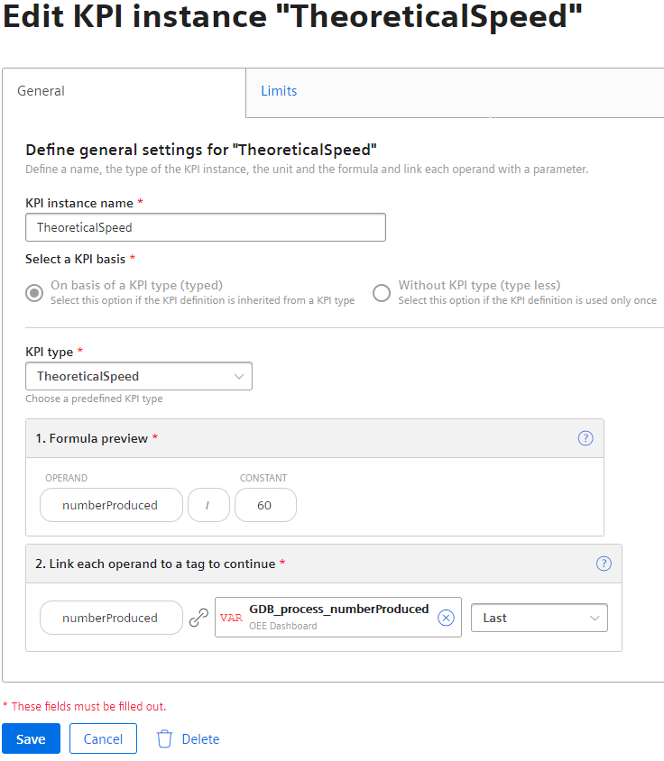
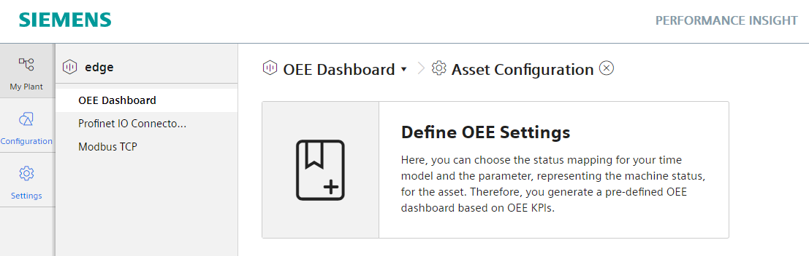
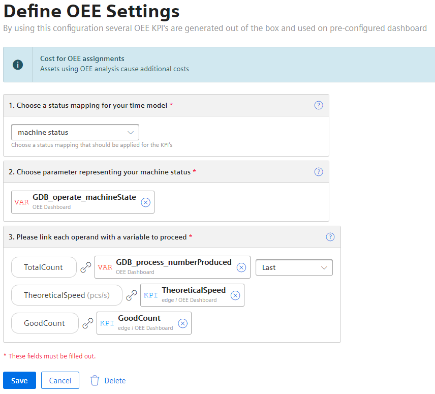
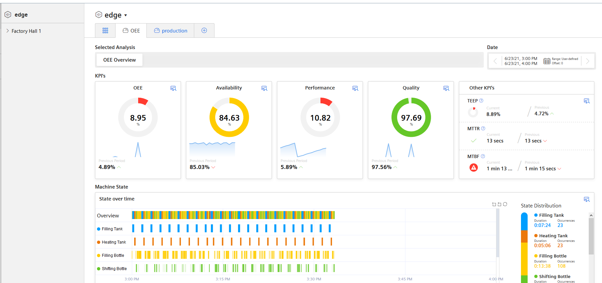

# Configuration

- [Configuration](#configuration)
  - [Configure Databus](#configure-databus)
  - [Configure Performance Insight](#configure-performance-insight)
    - [Configure status mapping](#configure-status-mapping)
    - [Configure KPI types](#configure-kpi-types)
    - [Configure Parameter](#configure-parameter)
    - [Configure OEE settings](#configure-oee-settings)
    - [Display OEE dashboard](#display-oee-dashboard)

## Configure Databus

Create a new Add Child with the following variables in the Data Service:

<kbd></kbd>

## Configure Performance Insight

### Configure status mapping

Open the Performance Insight status mapping and create new status mapping:

<kbd></kbd>

### Configure KPI types

Create two new KPI types:

<kbd></kbd>

<kbd></kbd>

### Configure Parameter

Open the parameters in the respective asset and create two new KPI instances:

<kbd></kbd>

<kbd></kbd>

### Configure OEE settings

Open Asset Configuration in the respective asset and define OEE settings:

<kbd></kbd>

1. select the created machine status under "status mapping

2. Select the machine status variable "GDB_operate_machineState"

2. select the respective variables and created KPI types

<kbd></kbd>

click on save.

### Display OEE dashboard

Open your asset in which the OEE settings have been made.

<kbd></kbd>
